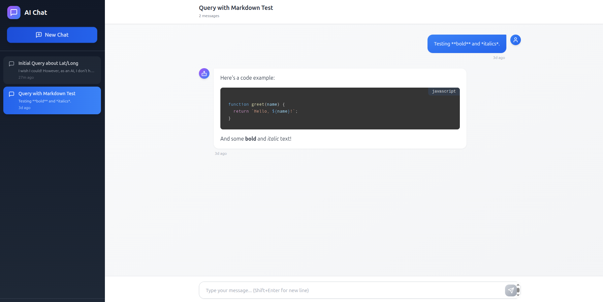

# Tracking Chatbot

A professional full-stack chat application powered by Google's Gemini AI, featuring real-time streaming responses, persistent conversation history, and a modern React interface with TypeScript.


## Demo



---

## 📋 Table of Contents

- [Architecture](#-architecture)
- [Tech Stack](#-tech-stack)
- [Prerequisites](#-prerequisites)
- [Installation](#-installation)
- [Configuration](#-configuration)
- [Running the Application](#-running-the-application)
- [Project Structure](#-project-structure)
- [API Documentation](#-api-documentation)
- [Usage Guide](#-usage-guide)
- [Development](#-development)
- [Troubleshooting](#-troubleshooting)

---


## 🏗️ Architecture

This application follows a **three-server architecture** for optimal separation of concerns:
```
┌─────────────────────────────────────────────────────────────┐
│                      Client Browser                          │
│                   (React + TypeScript)                       │
│                    Port: 5173 (Vite)                        │
└──────────────┬──────────────────────┬───────────────────────┘
               │                      │
               │ REST API             │ SSE Stream
               │                      │
       ┌───────▼──────┐      ┌───────▼──────────┐
       │  json-server │      │  Express Server   │
       │  Port: 3000  │      │   Port: 9000      │
       │              │      │                   │
       │ Conversations│      │ Gemini AI Proxy   │
       │ Messages     │      │ Streaming         │
       └──────┬───────┘      └──────┬────────────┘
              │                     │
              ▼                     ▼
          db.json              Gemini API
                              (Google Cloud)
```

### Component Flow
```
User Input → App.tsx → chatApi.ts → Express/json-server
                  ↓
           Components (Sidebar, ChatWindow, Message)
                  ↓
          MarkdownRenderer (with syntax highlighting)
```

---

## 🛠️ Tech Stack

### Frontend
- **React 18.3.1** - UI framework
- **TypeScript 5.6.3** - Type safety
- **Vite 5.4.10** - Build tool and dev server
- **Tailwind CSS 3.4.14** - Utility-first CSS
- **react-markdown 9.0.1** - Markdown rendering
- **react-syntax-highlighter 15.5.0** - Code syntax highlighting
- **lucide-react 0.263.1** - Modern icon library

### Backend
- **Node.js** - Runtime environment
- **Express 4.21.1** - Web server framework
- **json-server 0.17.4** - Mock REST API for data persistence
- **@google/generative-ai 0.21.0** - Official Gemini SDK
- **cors 2.8.5** - Cross-origin resource sharing
- **dotenv 16.4.5** - Environment variable management

---

## 📦 Prerequisites

Before you begin, ensure you have the following installed:

- **Node.js** >= 18.0.0 ([Download](https://nodejs.org/))
- **npm** >= 9.0.0 (comes with Node.js)
- **Google Gemini API Key** ([Get one here](https://makersuite.google.com/app/apikey))

Check your versions:
```bash
node --version
npm --version
```

---

## 🚀 Installation

### 1. Clone the Repository
```bash
git clone https://github.com/AbdoTW/Chatbot-Fawry-Tracking-System.git
cd Chatbot-Fawry-Tracking-System
```

### 2. Install Root Dependencies
```bash
npm install
```

### 3. Install Client Dependencies
```bash
cd client
npm install
cd ..
```

### 4. Verify Installation

Check that all packages are installed:
```bash
# Root packages
npm list --depth=0

# Client packages
cd client && npm list --depth=0 && cd ..
```

---

## ⚙️ Configuration

### 1. Add Your Gemini API Key

Open `.env` and add:
```env
GEMINI_API_KEY=your_actual_api_key_here
PORT=9000
```

**⚠️ Important:** Replace `your_actual_api_key_here` with your actual Google Gemini API key.


### 2. Database Setup

The `db.json` file contains initial data. You can modify it to add sample conversations:
```json
{
  "conversations": [
    {
      "id": "conv-001",
      "user_id": "user-a1b2c3d4e5",
      "title": "Sample Conversation",
      "last_message": "Hello!",
      "timestamp": "2025-10-27T00:00:00Z"
    }
  ],
  "messages": [
    {
      "id": "msg-001",
      "conversation_id": "conv-001",
      "role": "user",
      "content": "Hello!",
      "timestamp": "2025-10-27T00:00:00Z"
    }
  ]
}
```

---

## 🎯 Running the Application

You need to run **three servers** simultaneously. Open three terminal windows:

### Terminal 1: json-server (Port 3000)
```bash
npm run json-server
```

Expected output:
```
  \{^_^}/ hi!

  Loading db.json
  Done

  Resources
  http://localhost:3000/conversations
  http://localhost:3000/messages

  Home
  http://localhost:3000
```

### Terminal 2: Express Server (Port 9000)
```bash
npm start
```

Expected output:
```
🚀 Express server running on http://localhost:9000
📡 Gemini API Key configured: true
🔗 CORS enabled for: http://localhost:5173
```

### Terminal 3: React Frontend (Port 5173)
```bash
cd client
npm run dev
```

Expected output:
```
  VITE v5.4.21  ready in 152 ms

  ➜  Local:   http://localhost:5173/
  ➜  Network: use --host to expose
```

### Access the Application

Open your browser and navigate to:
```
http://localhost:5173
```

---

## 📁 Project Structure
```
ai-chat-app/
├── client/                          # Frontend React application
│   ├── src/
│   │   ├── api/
│   │   │   └── chatApi.ts          # API integration layer
│   │   ├── components/
│   │   │   ├── ChatWindow.tsx      # Main chat interface
│   │   │   ├── Layout.tsx          # Two-column layout wrapper
│   │   │   ├── MarkdownRenderer.tsx # Markdown & code highlighting
│   │   │   ├── Message.tsx         # Individual message component
│   │   │   └── Sidebar.tsx         # Conversation list sidebar
│   │   ├── types/
│   │   │   └── index.ts            # TypeScript type definitions
│   │   ├── App.tsx                 # Main app component & state
│   │   ├── main.tsx                # React entry point
│   │   └── index.css               # Global styles & animations
│   ├── public/                      # Static assets
│   ├── index.html                   # HTML entry point
│   ├── package.json                 # Frontend dependencies
│   ├── tailwind.config.js          # Tailwind CSS configuration
│   ├── tsconfig.json               # TypeScript configuration
│   └── vite.config.ts              # Vite bundler configuration
├── db.json                          # JSON database for conversations/messages
├── server.js                        # Express server for Gemini API
├── package.json                     # Backend dependencies
├── .env                            # Environment variables (API keys)
├── .gitignore                      # Git ignore rules
└── README.md                       # This file
```

### Key Files Explained

| File | Purpose |
|------|---------|
| `server.js` | Express server that proxies requests to Gemini API with streaming support |
| `db.json` | Local JSON database managed by json-server for data persistence |
| `client/src/App.tsx` | Main React component with state management and business logic |
| `client/src/api/chatApi.ts` | All API calls to json-server and Express server |
| `client/src/types/index.ts` | TypeScript interfaces, types, and utility functions |
| `client/src/components/` | Reusable React components for UI |
| `.env` | Environment variables (never commit this file!) |

---

## 📡 API Documentation

### json-server Endpoints (Port 3000)

#### Conversations

| Method | Endpoint | Description | Query Params |
|--------|----------|-------------|--------------|
| GET | `/conversations` | Get all conversations | `?user_id=xxx` |
| GET | `/conversations/:id` | Get specific conversation | - |
| POST | `/conversations` | Create new conversation | - |
| PATCH | `/conversations/:id` | Update conversation | - |
| DELETE | `/conversations/:id` | Delete conversation | - |

#### Messages

| Method | Endpoint | Description | Query Params |
|--------|----------|-------------|--------------|
| GET | `/messages` | Get all messages | `?conversation_id=xxx` |
| GET | `/messages/:id` | Get specific message | - |
| POST | `/messages` | Create new message | - |
| PATCH | `/messages/:id` | Update message | - |
| DELETE | `/messages/:id` | Delete message | - |

**Example:**
```bash
# Get all conversations for a user
curl "http://localhost:3000/conversations?user_id=user-a1b2c3d4e5"

# Get messages for a conversation
curl "http://localhost:3000/messages?conversation_id=conv-001"
```

### Express Server Endpoints (Port 9000)

| Method | Endpoint | Description | Request Body |
|--------|----------|-------------|--------------|
| GET | `/health` | Health check | - |
| POST | `/chat` | Stream AI response | `{ query: string, history: Array }` |

**Example:**
```bash
# Health check
curl http://localhost:9000/health

# Send chat message (streaming response)
curl -X POST http://localhost:9000/chat \
  -H "Content-Type: application/json" \
  -d '{
    "query": "Hello, how are you?",
    "history": []
  }'
```

### Frontend API Functions

Located in `client/src/api/chatApi.ts`:
```typescript
// Conversation management
getConversations(userId: string): Promise<Conversation[]>
createConversation(conversation: Conversation): Promise<Conversation>
updateConversation(id: string, updates: Partial<Conversation>): Promise<Conversation>
deleteConversation(id: string): Promise<void>

// Message management
getMessages(conversationId: string): Promise<Message[]>
saveMessage(message: Message): Promise<Message>
saveMessagePair(user: Message, assistant: Message, convId: string): Promise<{user, assistant}>

// AI streaming
sendMessageStream(query: string, history: GeminiHistoryItem[]): AsyncGenerator<StreamChunk>

// Utilities
getUserLocation(): Promise<{latitude: number, longitude: number}>
testExpressConnection(): Promise<boolean>
testJsonServerConnection(): Promise<boolean>
```

---

## 📖 Usage Guide

### Starting a New Conversation

1. Click the **"New Chat"** button in the sidebar
2. Type your message in the input box at the bottom
3. Press **Enter** or click the **Send** button
4. Watch the AI response stream in real-time
5. The conversation is automatically saved and appears in the sidebar

### Continuing an Existing Conversation

1. Click on any conversation in the sidebar
2. The message history loads automatically
3. Type your message and send
4. New messages are appended to the conversation

### Keyboard Shortcuts

- **Enter** - Send message
- **Shift + Enter** - New line in message
- **Ctrl/Cmd + R** - Refresh page (conversations persist)

### Features in Action

#### Code Blocks
When the AI provides code, hover over it to see the **Copy** button:
```javascript
// Example code from AI
function greet(name) {
  return `Hello, ${name}!`;
}
```

#### Markdown Support
The AI can use **bold**, *italic*, and other markdown formatting:
- Bullet lists
- Numbered lists
- Links
- Tables
- Blockquotes

#### Location Tracking
If you allow location access, your messages will include coordinates visible in the timestamp area.

---

## 📄 License

This project is licensed under the MIT License - see the [LICENSE](LICENSE) file for details.

---